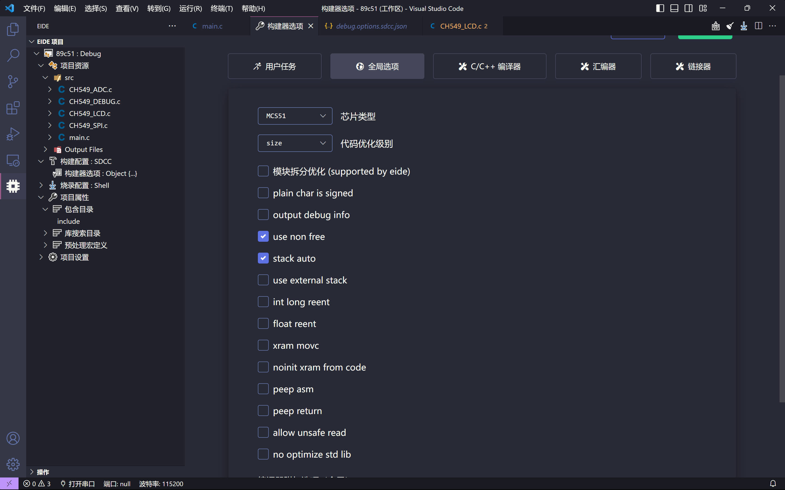
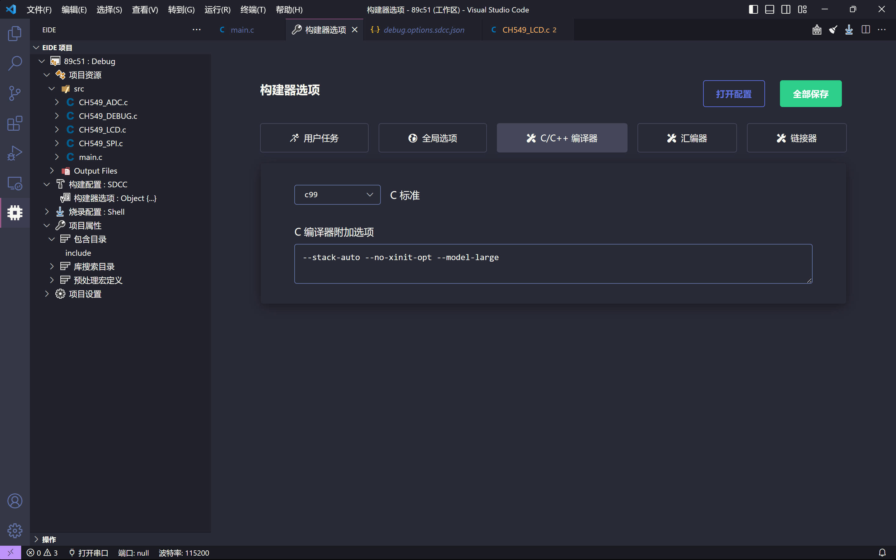
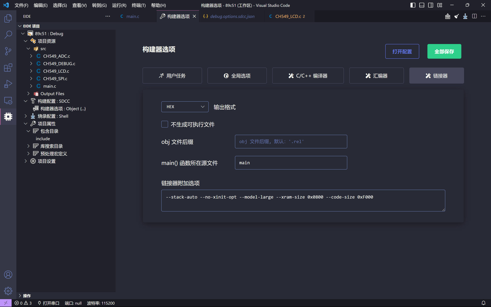

## 插件 Eide

### 包含目录
包含目录（IncludePath）是指 `c` 头文件（`.h`）的搜索路径

这个配置包含了项目的全局的包含目录

如果编译器在构建时出现一个错误，并告诉您没有找到 `xx.h` 文件，可能需要检查此配置
### 库目录

当使用 `-l` 命令行选项（比如：-`lxxx`, `-lmy_lib`）添加了一些库时（`.lib`, `.a`），该配置将告诉链接器这些库文件的搜索路径

注意
这个配置仅适用于 GCC 系列编译器，对于其他类型编译器， 你可以使用 添加源文件 功能直接添加 `.lib`, `.obj` 文件到项目，这将获得同样的效果

##  我的EIDE 配置（CH549）







## Sdcc 语法差距

```C
{
sbit pin=P1^0;//KEIL 中定义 pin 为 P1.1

#define pin P1_0//SDCC 中定义 pin 为 P1.1
__sbit __at 0x90 pin//SDCC 
SBIT(pin,0x90,0);//SDCC 

void Timer0() interrupt 1//KEIL 中定义 Timer0()为中断1的中断服务函数
void Timer0() __interrupt 1//SDCC 中定义 Timer0()为中断1的中断服务函数
//declare nvic function before use 在使用中断函数之前要声明

//keil
int data number;

//sdcc
int __data sdcc;
//在keil关键字data、bdata、idata、xdata、code等前面加上两个_就是sdcc关键字,如__code
}
```


### CH549
CH549 芯片是一款兼容 MCS51 指令集的增强型 E8051 内核单片机，其 79%的指令是单字节单周期
指令，平均指令速度比标准 MCS51 快 8~15 倍。
CH549 支持最高 48MHz 系统主频，内置 64K 程序存储器 Flash-ROM 和 256 字节内部 iRAM 以及 2K
字节片内  xRAM，xRAM 支持 DMA 直接内存存取。

[CH549官方资料地址](https://www.wch.cn/products/CH549.html)
